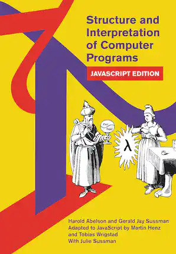

# Introduction to JavaScript

## History


> “I was recruited to Netscape with the promise of doing Scheme in the browser”

<table>
<tr>
<th>Racket (PLT Scheme)</th>
<th>JavaScript</th>
</tr>
<tr>
<td>

```scheme
(define (squares n)
  (for/stream ([x (in-range n)])
    (* x x)))


(writeln (stream->list (squares 10)))

; (0 1 4 9 16 25 36 49 64 81)
```

</td>
<td>

```js
function* squares(n) {
    for (let x = 0; x < n; ++x) {
        yield x * x;
    }
}

console.log(Array.from(squares(10)));

// [ 0, 1, 4, 9, 16, 25, 36, 49, 64, 81 ]
```

</td>
</tr>
</table>

- Designed and implemented as *LiveScript* over 10 days in 1995 by Brendan Eich at Netscape
- Main influences:
  - Scheme (Functions)
  - Self (Prototypes)
  - Java (Syntax)
  - Perl (Regular expressions)
- Released in 1996 as *JavaScript*® for marketing purposes
  - Registered trademark of Oracle America Inc.
- Standardized as *ECMAScript* in 1997 (*E*uropean *C*omputer *M*anufacturers *A*ssociation)
- Long version gap between 2005 and 2015
  - Time for browser implementers to catch up
- Yearly releases since 2015 (ES6)

## Platforms

 ```html
<!DOCTYPE html>
<html>
<head>
<meta charset="UTF-8">
<link     rel="stylesheet"     href="pretty.css">
<script  type="text/javascript" src="bundle.js"></script>
</head>
<body>

<div style="display: flex">
    <textarea id="output" style="flex: 0px" rows="50"></textarea>
</div>

</body>
<script  type="text/javascript">

// ...
let response = await fetch("https://raw.githubusercontent.com/frectures/js/master/README.md");
let text     = await response.text();

document.getElementById("output").value = text;
// ...

</script>
</html>
```

- Browser (frontend)
  - HTML (*H*yper*T*ext *M*arkup *L*anguage)
  - CSS (*C*ascading *S*tyle *S*heets)
  - JS (*J*ava*S*cript)
  - DOM (*D*ocument *O*bject *M*odel)
- Node.js (backend)
  - JavaScript runtime environment built on Chrome's V8 JavaScript engine
  - High-performance, asynchronous server code
- Electron = Chromium + Node.js (cross-platform desktop applications)
  - Atom
  - Discord
  - Microsoft Teams
  - Skype
  - Visual Studio Code

## Type system

- Dynamically typed
- Primitives
  1. `undefined`
     - uninitialized variables
     - function calls without return value
     - missing function arguments
     - missing object properties
     - array index out of bounds
  2. `boolean`
     - `false`
     - `true`
  3. `number` (double precision floating point)
     - `0.1 + 0.2 == 0.30000000000000004`
     - Contains all integers up to 2<sup>53</sup> = `9_007_199_254_740_992`
  4. `bigint` (arbitrary precision integer)
     - `123n`
     - `BigInt(456)`
  5. `string` (UTF-16)
     - `"Ain't no sunshine"`
     - `'The cow says: "Moo"'`
     - `` `Frantic fans: "It's great!"` ``
  6. `null`
- `Object`
  - `Function`
  - `Array`
  - ...


> “Choosing JavaScript was deeply ironic for me, as many readers may know, I'm not a fan of it.
> It has too many **awkward edge cases and clunky idioms**.
> But the compelling reason for choosing it over Java is that isn't wholly centered on classes.
> There are top-level functions, and use of first-class functions is common.
> This makes it much easier to show refactoring out of the context of classes.”

### The `typeof` operator

```js
typeof undefined  === "undefined"
typeof false      === "boolean"
typeof 3.14       === "number"
typeof 123n       === "bigint"
typeof "hello"    === "string"
typeof "hi"[0]    === "string"   🤔
typeof null       === "object"   🤔

typeof {}         === "object"
typeof Math.log   === "function"
typeof []         === "object"   🤔
Array.isArray([]) === true
```

## Variables

- `var` variables have function scope:

```js
function f() {
    // ...             // scope of x
    {                 //
        // ...       //
        var x = 42; //
        // ...     //
    }             //
    // ...       //
}                   
```

- `let` variables have block scope:

```js
function f() {
    // ...
    {
        // ...
        let x = 42; // scope of x
        // ...     //
    }
    // ...
}                   
```

- `const` requires initialization and forbids assignment:

```js
function f() {
    const uninitialized; // error: const requires initialization

    const x = 42;
    x = 97;              // error: const forbids assignment

    const account = new Account();
    account.deposit(42);     //    ok: method call is not assignment
    account = new Account(); // error: const forbids assignment
}
```

## [Equality](https://stackoverflow.com/a/23465314)

- Type-safe equality via `===` and `!==` (compares type and value)


- Type-unsafe equality via `==` and `!=` (confusing type coercions)


- There is no universal `equals` method for object equality

## Truthy vs. falsy values

- `condition ? "truthy" : "falsy"`
- All falsy values:
  - `undefined`
  - `false`
  - `NaN`
  - `+0.0`
  - `-0.0`
  - `0n`
  - `""`
  - `null`
- All other values are truthy

## Control flow

### Conditionals

```js
let coin;
if (Math.random() < 0.5) {
    coin = "heads";
} else {
    coin = "tails";
}

const coin = Math.random() < 0.5 ? "heads" : "tails";
```

### switch/case

```js
switch (expression) {
    case 42: // ...
    break;

    case "hello": // ...
    break;

    case true: // ...
    break;

    case f(): // ...
    break;

    default: // ...
}
```

### Loops

```js
for (let i = 0; i < s.length; ++i) {
    console.log(s[i]);
}


let x = 1;
while (x + 1 > x) {
    x *= 2;
}
console.log(x + " is the smallest integer without odd successor");


let password;
do {
    password = readPassword();
} while (password !== "Simsalabim");
```

### Exceptions

```js
try {
    // ...
} catch (ex) {
    // ...
} finally {
    // ...
}
```

- A single `catch` block catches all exceptions
- At least one of `catch` and `finally` must be present
- All JavaScript values, including primitives, can be thrown

```js
throw null;
throw undefined;
throw true;
throw 42.0;
throw "string literal";

throw new Error("error object");

throw { message: "object literal" };

throw function () { };
```

## Functions



```js
function f(x, y) {
    return (x + y) / 2;
}

const g = function (x, y) {
    return (x + y) / 2;
};
```

- `function f` does not prevent accidental reassignment:
  - `f = "uh oh";` 😱
- `const g = function` cannot be called above its definition
- Missing arguments are initialized to `undefined`
- Extra arguments are ignored
- Implicit `return undefined;` at the bottom

### Generator functions

```js
function* fibonacciSequence() {
    let a = 0n;
    yield a;

    let b = BigInt(1);
    yield b;

    while (true) {
        yield a += b;
        yield b += a;
    }
}

for (const fib of fibonacciSequence()) {
    if (fib >= 1000) break;
    console.log(fib);   // 0n 1n 1n 2n 3n 5n 8n 13n 21n 34n 55n 89n 144n 233n 377n 610n 987n
}
```

- `function*`s are stackless coroutines
  - Implemented via state machines
  - Similar to C# [iterator methods](https://learn.microsoft.com/en-us/dotnet/csharp/iterators#enumeration-sources-with-iterator-methods) (`yield return`)

### Higher-order functions

- Can we extract the essence of `fixCos` and `fixSqrt` into one `fix` function?

<table>
<tr>
<th>fixCos</th>
<th>fixSqrt</th>
</tr>
<tr>
<td>

```js
function* fixCos() {
    let x = 0.0; //////////////////
    do {                       ///
        yield x;              ///
    } while (x !== (x = Math.cos(x)));
}

for (const x of fixCos()) {
    console.log(x);
    // 0
    // 1
    // 0.5403023058681397
    // ...
    // 0.7390851332151608
    // 0.7390851332151606
    // 0.7390851332151607
}
```

</td>
<td>

```js
function* fixSqrt() {
    let x = 0.5; ///////////////////
    do {                       ////
        yield x;              ////
    } while (x !== (x = Math.sqrt(x)));
}

for (const x of fixSqrt()) {
    console.log(x);
    // 0.5
    // 0.7071067811865476
    // 0.8408964152537146
    // ...
    // 0.9999999999999997
    // 0.9999999999999998
    // 0.9999999999999999                
}
```

</td>
</tr>
</table>

- Yes, by abstracting over `f` and `x`:

```js
function* fix(f, x) {
    do {
        yield x;
    } while (x !== (x = f(x)));
}
                          /////////
for (const x of fix(Math.cos,  0.0)) {
    console.log(x);
}
                          /////////
for (const x of fix(Math.sqrt, 0.5)) {
    console.log(x);
}
```

- Functions are first class, hence functions can be:
  - passed as arguments
  - returned as results
  - stored in properties

### Closures

```js
function makeCounter() {
    let next = 1;
    return function () {
        return next++;
    };
}

const counter = makeCounter();

console.log(counter()); // 1
console.log(counter()); // 2
console.log(counter()); // 3
```

- Functions have access to their surrounding context
- Even after the enclosing function has returned!

### Arrow functions

```js
function makeCounter() {
    let next = 1;
    return () => next++;
}
```

- Great fit as arguments to higher-order functions:

```js
for (const x of fix(x => Math.pow(x, 0.5), 0.5)) {
    console.log(x);
}
```

- JavaScript hipsters prefer arrow functions everywhere:

```js
const average = (x, y) => (x + y) / 2;
```


## Objects

> Even though ECMAScript includes syntax for class definitions,
> **[ECMAScript objects](https://tc39.es/ecma262/#sec-objects) are not fundamentally class-based**
> such as those in C++, Smalltalk, or Java

- A JavaScript object is essentially a `java.util.LinkedHashMap<String, Object>`
- Quotation marks around keys in object literals are optional

```js
// object literal
const inventor = { "surname": "Eich", forename: "Brendan" };

// access properties
inventor.forename   // 'Brendan'
inventor["surname"] // 'Eich'

// add properties
inventor["year"]  = 1961;         // { surname: 'Eich', forename: 'Brendan', year: 1961 }
inventor.language = "JavaScript"; // { surname: 'Eich', forename: 'Brendan', year: 1961, language: 'JavaScript' }

// remove properties
delete inventor.forename;         // { surname: 'Eich', year: 1961, language: 'JavaScript' }
```

- Properties are accessed:
  - unquoted after dot, or
  - quoted inside brackets
- Objects are class-free
  - Properties can be added and removed at will

### Factory functions

```js
function createAccount(initialBalance, accountId) {
    return {
        balance: initialBalance,
        id: accountId,

        deposit: function (amount) {
            this.balance += amount;
        },

        getBalance: function () {
            return this.balance;
        },
    };
}

const account = createAccount(1000, 42);
// { balance: 1000, id: 42, deposit: [Function: deposit], getBalance: [Function: getBalance] }

account.deposit(234);
account.getBalance() // 1234

createAccount(1234, 42).getBalance === account.getBalance // false
```

### Object inheritance

```js
const accountMethods = {
    deposit: function (amount) {
        this.balance += amount;
    },

    getBalance: function () {
        return this.balance;
    },
};

function createAccount(initialBalance, accountId) {
    return {
        __proto__: accountMethods,

        balance: initialBalance,
        id: accountId,
    };
}

const account = createAccount(1000, 42);
// { balance: 1000, id: 42 }

account.__proto__
// { deposit: [Function: deposit], getBalance: [Function: getBalance] }

account.deposit(234);
account.getBalance() // 1234

createAccount(1234, 42).getBalance === account.getBalance // true
```

- *Read* access `obj.m` starts at `obj` and climbs the inheritance chain:
  - `obj.m`
  - `obj.__proto__.m`
  - `obj.__proto__.__proto__.m`
  - `obj.__proto__.__proto__.__proto__.m`
  - etc. until `m` is found (or `__proto__` is `null`)
- *Write* access `obj.m = ...` ignores `obj.__proto__`

### Constructor functions

```js
function Account(initialBalance, accountId) {
    this.balance = initialBalance;
    this.id = accountId;
}

// Account.prototype = { constructor: Account };

Account.prototype.deposit = function (amount) {
    this.balance += amount;
};

Account.prototype.getBalance = function () {
    return this.balance;
};

            /* Account.call({ __proto__: Account.prototype },
                            1000, 42) */
const account = new Account(1000, 42);
// Account { balance: 1000, id: 42 }

account.__proto__
// { deposit: [Function (anonymous)], getBalance: [Function (anonymous)] }

account.deposit(234);
account.getBalance() // 1234

new Account(1234, 42).getBalance === account.getBalance // true
```

- By convention, functions starting with an uppercase letter are *constructor functions*
  - Must be invoked with `new` to create `{ __proto__: F.prototype }`
  - Otherwise, `this` is `undefined`
- *Every* function has an associated `prototype` property
  - But it's only useful for constructor functions

| Function call syntax      | `this`      |
| ------------------------- | :---------: |
| `f(x, y, z)`              | `undefined` |
| `obj.f(x, y, z)`          | `obj`       |
| `new F(x, y, z)`          | `{ __proto__: F.prototype }` |
| `f.apply(obj, [x, y, z])` | `obj`       |
| `f.call(obj, x, y, z)`    | `obj`       |
| `f.bind(obj)(x, y, z)`    | `obj`       |


&nbsp;


### The `class` keyword

```js
class Account {
    constructor(initialBalance, accountId) {
        this.balance = initialBalance;
        this.id = accountId;
    }

    deposit(amount) {
        this.balance += amount;
    }

    getBalance() {
        return this.balance;
    }
}

const account = new Account(1000, 42);
// Account { balance: 1000, id: 42 }

account.__proto__                       // {}
account.__proto__ === Account.prototype // true
account.__proto__.deposit               // [Function: deposit]
account.__proto__.getBalance            // [Function: getBalance]
```

- JavaScript has no runtime notion of classes
- The `class` keyword merely coats syntactic sugar over the prototype system


## Arrays

```js
const primes = [2, 3, 5, 7];
typeof primes                      // 'object'
Object.getOwnPropertyNames(primes) // [ '0', '1', '2', '3', 'length' ]

primes.length // 4
primes[0]     // 2
primes[4]     // undefined

primes[4] = 11;      // [ 2, 3, 5, 7, 11 ]
primes.push(13);     // [ 2, 3, 5, 7, 11, 13 ]
primes.push(17, 19); // [ 2, 3, 5, 7, 11, 13, 17, 19 ]
primes[24] = 97;     // [ 2, 3, 5, 7, 11, 13, 17, 19, <16 empty items>, 97 ]
primes.length = 5;   // [ 2, 3, 5, 7, 11 ]
primes.pop();        // [ 2, 3, 5, 7 ]
```

- JavaScript arrays are JavaScript objects with a special `length` property
  - The keys are stringified numbers
- The (mutable!) `length` property is the largest index +1
- There are no "array index out of bounds" errors:
  - Reading from such an index gives `undefined`
  - Writing to such an index grows the array

### Iteration

```js
for (let i = 0; i < primes.length; ++i) {
    console.log(primes[i]);
}

primes.forEach(function (element, index, array) {
    console.log(element);
});

for (const p of primes) {
    console.log(p);
}
```

### Sorting

```js
// sort objects by their toString representation
primes.sort();
// [ 11, 13, 17, 19, 2, 3, 5, 7 ]

// sort numbers by their numeric value
primes.sort((a, b) => a - b);
// [ 2, 3, 5, 7, 11, 13, 17, 19 ]
```

### Functional

```js
const people = [
    { forename: "Alan",   surname: "Turing",     year: 1912 },
    { forename: "Alan",   surname: "Kay",        year: 1940 },
    { forename: "Bjarne", surname: "Stroustrup", year: 1950 },
    { forename: "Brian",  surname: "Kernighan",  year: 1942 },
    { forename: "Dennis", surname: "Ritchie",    year: 1941 },
    { forename: "James",  surname: "Gosling",    year: 1955 },
];

const whippersnappers = people.filter(person => person.year >= 1950);

const years           = people.map(person => person.year);

const yearSum         = people.reduce((sumSoFar, person) => sumSoFar + person.year, 0);

const sortedByYear    = people.toSorted((a, b) => a.year - b.year);

const sortedBySurname = people.toSorted((a, b) => a.surname.localeCompare(b.surename));
```

### Polyfills

- Not all JavaScript environments provide `toSorted` yet
- In that case, we can monkey-patch it into the prototype:

```js
if (Array.prototype.toSorted === undefined) {
    Array.prototype.toSorted = function (compare) {
        //            spread operator
        const copy = [...this];
        copy.sort(compare);
        return copy;
    };
}
```

## Modules

- One file per module
- Explicit `export`s and `import`s
- Browsers support modules via `<script type="module" src="app.js">` from web server
- But modules are usually bundled into a single `bundle.js` file by module bundlers like Webpack

### Named exports

```js
// trig.js
export const PI = 3.141592653589793;
const RADIANS_PER_DEGREE = PI / 180; // not exported

export function radians(degrees) {
    return degrees * RADIANS_PER_DEGREE;
}

export function degrees(radians) {
    return radians / RADIANS_PER_DEGREE;
}

export function distance(x, y) {
    return Math.sqrt(square(x) + square(y));
}

// not exported
function square(x) {
    return x * x;
}
```

### Named imports

```js
// app.js
import { PI, distance as distanceFromOrigin } from './trig';

const distance = 1.5;

console.log(PI);
console.log(distanceFromOrigin(3, 4));
```

### Namespace import

```js
// app.js
import * as trig from './trig';

const distance = 1.5;

console.log(trig.PI);
console.log(trig.distance(3, 4));
```
