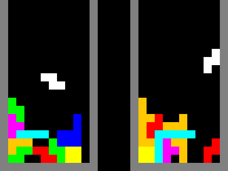
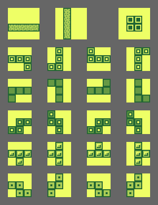

# Tetris

- Write a Tetris clone, in groups of 1/2/3 people
- Your journey is guided by [Milestones](#milestones) and [FAQs](#faq)
  - Hard mode: Ignore the FAQs; research everything yourself
- Which functions and classes should you write?
  - That is entirely (and intentionally!) up to you
  - Hopefully, this will result in many different solutions to compare and contrast
- If you are completely stuck, feel free to ask, of course!



## Milestones

### Single player, single piece

- The player sees an empty 10x20 board, with a gray border around it
- The player sees a yellow 2x2 `O` piece at the top of the board
- The player can move the piece left, right, or down (“soft drop”)
  - once per keypress
  - within the border

### Multiple pieces

- If the piece *would* move into the bottom border:
  - Integrate the piece into the board instead
  - Create a new piece at the very top of the board
- The current piece must not collide with other pieces!
- The player can instantly drop and integrate the piece (“hard drop”)

### Multiple shapes

- There are 6 other shapes beside the `O` shape:



- Every time a new piece is created at the top, pick a shape at random

### Rotation

- The player can rotate the piece 90° clockwise
- If the rotation *would* result in a collision:
  - Either ignore the rotation attempt
  - Or try to resolve the collision with slight horizontal movement
- Note how “irregular” some rotations are in the screenshot above?
  - Just store all possible rotations somewhere instead of rotating pieces “on the fly”

### Gravity

- The piece falls down automatically, once per second
- If the player also presses down once a second, the piece should move once total, *not* twice!

### Remove full lines

- Every time a piece is integrated into the board, check for full lines
- Remove full lines; the lines above are pulled down
- For every 10 lines removed, increase the gravity

### Friends

- Two players play side by side
- They do not influence each other
- If your code so far is full of global variables:
  - Do *not* copy/paste the player-specific variables!
  - Move those variables into a `class` instead
  - Then you can instantiate that `class` twice

### Enemies

- If a player completes multiple lines, send penalty lines to the opponent

| Full lines | Penalty lines |
| ---------: | :------------ |
|          2 | 1             |
|          3 | 2             |
|          4 | 4             |


- Penalty lines appear at the bottom and push the existing lines up
- Penalty lines are not full, but have 1 random hole in them

### Fairness

- Both players should get the same random shapes
- The first 7 random shapes should all be different
- The next 7 random shapes should all be different etc.

### Score

- Display a score below the board
- Every “hard drop” is worth the distance it was dropped
- Full lines are scored as follows:

| Lines | Points |
| :---: | -----: |
|     1 |     40 |
|     2 |    100 |
|     3 |    300 |
|     4 |   1200 |

### Polish

- Draw the next piece above the board
- Draw a shadow/ghost piece where the current piece would land
  - This reduces hard-drop errors
- Replace the rectangles with nicer looking images

## FAQ

### How do I draw a rectangle?

```html
<body style="margin: 0px">

<canvas id="canvas" width="1920" height="1080"></canvas>

</body>
```

```js
const canvas = document.getElementById("canvas");
const context = canvas.getContext("2d", { alpha: false });

context.fillStyle = "#03c2ca";
context.fillRect(
    Math.random() * 320, // x
    Math.random() * 240, // y
    32, // width
    24  // height
);
```

### How do I listen to key events inside a canvas?

```js
canvas.tabIndex = 0; // make canvas focus-able
canvas.focus();
canvas.style.outline = "none";

canvas.onkeydown = function ({key}) {
    console.log(key);

    // swallow every key, except reload and devtools
    return key === "F5" || key === "F12";
}
```

### What does `function ({key}) { ... }` mean?

- That's a function with a destructured parameter list
- It means the same as `function (event) { let key = event.key; ... }`

### How do I keep drawing frames?

- Assuming roughly 30 frames per second
- `setInterval` solution:

```js
function gameLoop() {
    // ... draw ...
}

setInterval(gameLoop, 1000 / 30); // call gameLoop every 33 ms
```

- `setTimeout` solution:

```js
function gameLoop() {
    setTimeout(gameLoop, 1000 / 30); // next call to gameLoop in 33 ms

    // ... draw ...
}

setTimeout(gameLoop, 1000 / 30); // first call to gameLoop in 33 ms
```

### How do I generate my own deterministic random numbers?

- Closure solution:

```js
function randomNumberGenerator(seed) {
    return function () {                 // 31 bit modulo arithmetic
        seed = (214013 * seed + 2531011) & 0x7fffffff;
        return seed >>> 16;
    }               // discard low-periodicity bits
}

const generate = randomNumberGenerator(Date.now());

const a = generate();
const b = generate();
const c = generate();
// ...
```

- Generator solution:

```js
function* randomNumberGenerator(seed) {
    while (true) {                       // 31 bit modulo arithmetic
        seed = (214013 * seed + 2531011) & 0x7fffffff;
        yield seed >>> 16;
    }              // discard low-periodicity bits
}

const generator = randomNumberGenerator(Date.now());

const a = generator.next().value;
const b = generator.next().value;
const c = generator.next().value;
// ...
```

### How do I draw text?

```js
context.font = "42px monospace";
context.fillStyle = "white";
context.fillText("Make lav not war", 0, 42);
```

### How do I draw an image?

```js
const img = document.createElement("img");
img.onload = function () {
    context.drawImage(img, 0, 0);
};
img.src = "filename.png";
```

- ⚠️ Do *not* load images inside the game loop!
- That would load the images over and over and over again
- Instead, load the images once inside some startup code

### Can I wrap `img.onload` into a Promise?

```js
function loadImage(src) {
    return new Promise((resolve, reject) => {
        const img = document.createElement("img");
        img.onload = () => resolve(img);
        img.onerror = reject;
        img.src = src;
    });
}

const img = await loadImage("filename.png");
context.drawImage(img, 0, 0);
```

- ⚠️ Again, do *not* load images inside the game loop!
- Also note that `await` only works inside `async` functions
